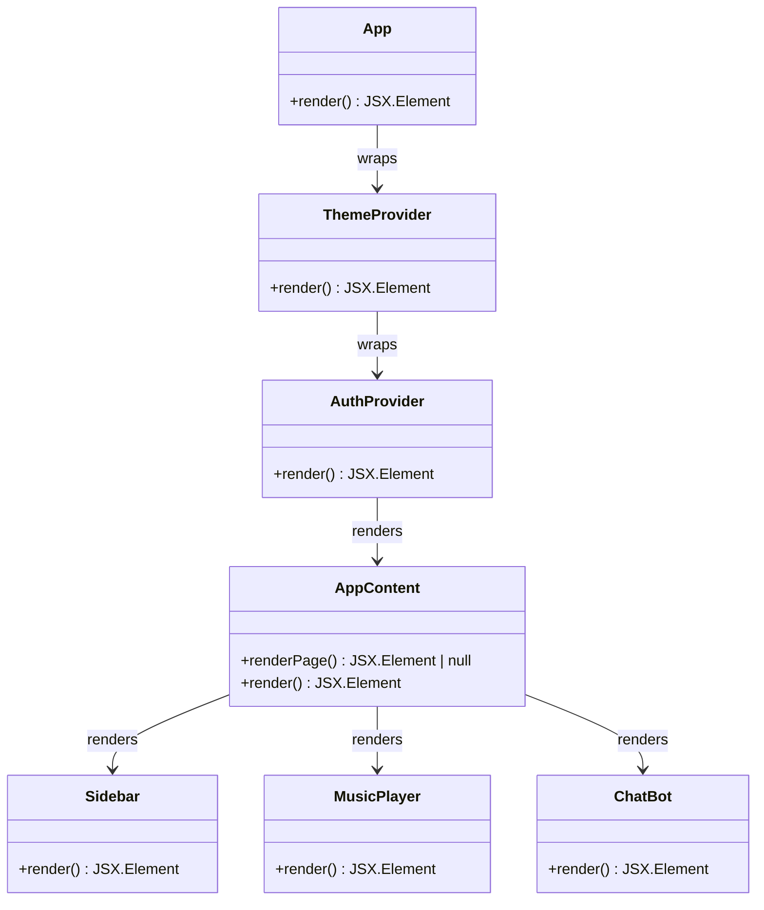

# App Class Diagram

```mermaid
classDiagram
    class App {
        +render() JSX.Element
    }

    class AppContent {
        +renderPage() JSX.Element | null
        +render() JSX.Element
    }

    class ThemeProvider {
        +render() JSX.Element
    }

    class AuthProvider {
        +render() JSX.Element
    }

    class Sidebar {
        +render() JSX.Element
    }

    class MusicPlayer {
        +render() JSX.Element
    }

    class ChatBot {
        +render() JSX.Element
    }

    App --> ThemeProvider : wraps
    ThemeProvider --> AuthProvider : wraps
    AuthProvider --> AppContent : renders

    AppContent --> Sidebar : renders
    AppContent --> MusicPlayer : renders
    AppContent --> ChatBot : renders
```

